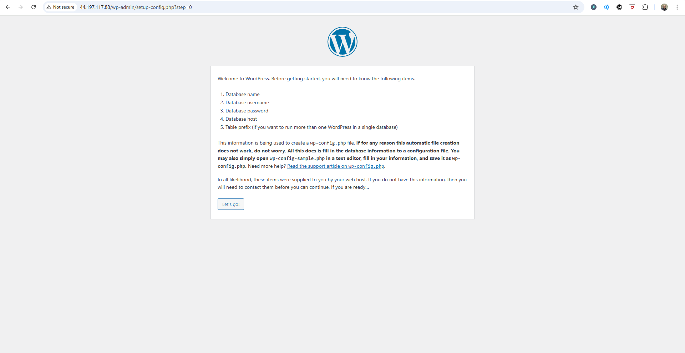
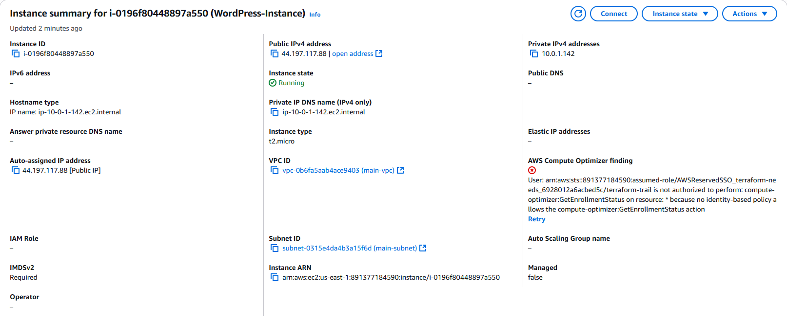

# Terraform Documentation: Auto Scaling Group with WordPress Deployment

## 🎯 Objective

To configure **Auto Scaling** for a WordPress application on AWS using Terraform by:

* Creating an Auto Scaling Group (ASG)
* Defining scaling policies based on CPU metrics
* Setting up launch configurations
* Documenting all Terraform commands and configuration steps

---

## 🖥️ Project Overview

This project aims to provision a scalable WordPress application on AWS using Terraform. It includes launching EC2 instances with a Load Balancer and Auto Scaling Group, dynamically adjusting based on CPU utilization. The infrastructure will use CloudWatch alarms to trigger scaling actions.

---

## 📁 Project Structure

```bash
.
├── main.tf
├── variables.tf
├── outputs.tf
├── terraform.tfvars
├── modules/
│   ├── ec2/
│   ├── autoscaling/
│   ├── cloudwatch/
│   └── networking/
├── user_data.sh
└── README.md
```

---

## 1️⃣ Terraform Script Overview

### a. Launch Configuration

```hcl
resource "aws_launch_configuration" "wordpress_lc" {
  name_prefix          = "wordpress-lc-"
  image_id             = var.ami_id
  instance_type        = var.instance_type
  security_groups      = var.security_group_ids
  key_name             = var.key_name
  associate_public_ip_address = true

  lifecycle {
    create_before_destroy = true
  }
}
```

### b. Auto Scaling Group

```hcl
resource "aws_autoscaling_group" "wordpress_asg" {
  launch_configuration = aws_launch_configuration.wordpress_lc.name
  vpc_zone_identifier  = var.subnet_ids
  min_size             = 1
  max_size             = 3
  desired_capacity     = 1
  health_check_type    = "EC2"
  health_check_grace_period = 300
  force_delete         = true

  tag {
    key                 = "Name"
    value               = "WordPressASG"
    propagate_at_launch = true
  }
}
```

### c. Scaling Policies

```hcl
resource "aws_autoscaling_policy" "scale_up" {
  name                   = "scale-up"
  autoscaling_group_name = aws_autoscaling_group.wordpress_asg.name
  adjustment_type        = "ChangeInCapacity"
  scaling_adjustment     = 1
  cooldown               = 300
}

resource "aws_autoscaling_policy" "scale_down" {
  name                   = "scale-down"
  autoscaling_group_name = aws_autoscaling_group.wordpress_asg.name
  adjustment_type        = "ChangeInCapacity"
  scaling_adjustment     = -1
  cooldown               = 300
}
```

### d. CloudWatch Alarms

```hcl
resource "aws_cloudwatch_metric_alarm" "high_cpu" {
  alarm_name          = "high-cpu-alarm"
  comparison_operator = "GreaterThanThreshold"
  evaluation_periods  = 2
  metric_name         = "CPUUtilization"
  namespace           = "AWS/EC2"
  period              = 120
  statistic           = "Average"
  threshold           = 70

  alarm_description   = "Alarm when CPU exceeds 70%"
  dimensions = {
    AutoScalingGroupName = aws_autoscaling_group.wordpress_asg.name
  }

  alarm_actions = [aws_autoscaling_policy.scale_up.arn]
}

resource "aws_cloudwatch_metric_alarm" "low_cpu" {
  alarm_name          = "low-cpu-alarm"
  comparison_operator = "LessThanThreshold"
  evaluation_periods  = 2
  metric_name         = "CPUUtilization"
  namespace           = "AWS/EC2"
  period              = 120
  statistic           = "Average"
  threshold           = 30

  alarm_description   = "Alarm when CPU drops below 30%"
  dimensions = {
    AutoScalingGroupName = aws_autoscaling_group.wordpress_asg.name
  }

  alarm_actions = [aws_autoscaling_policy.scale_down.arn]
}
```

---

## 2️⃣ Terraform Variables

```hcl
variable "ami_id" {}
variable "instance_type" { default = "t2.micro" }
variable "security_group_ids" { type = list(string) }
variable "subnet_ids" { type = list(string) }
variable "key_name" {}
```

```
variable "vpc_id" {
  description = "The ID of the VPC"
  type        = string
}

variable "subnet_id" {
  description = "The ID of the subnet"
  type        = string
}

variable "security_group_id" {
  description = "The ID of the security group"
  type        = string
}
variable "vpc_cidr" {
  description = "CIDR block for the VPC"
  type        = string
  default     = "10.0.0.0/16"
}

variable "private_subnet_cidr_1" {
  description = "CIDR block for private subnet 1"
  type        = string
  default     = "10.0.1.0/24"
}

variable "private_subnet_cidr_2" {
  description = "CIDR block for private subnet 2"
  type        = string
  default     = "10.0.2.0/24"
}

variable "public_subnet_cidr" {
  description = "CIDR block for public subnet"
  type        = string
  default     = "10.0.3.0/24"
}

variable "availability_zone_1" {
  description = "Availability Zone 1"
  type        = string
  default     = "us-east-1a"
}

variable "availability_zone_2" {
  description = "Availability Zone 2"
  type        = string
  default     = "us-east-1b"
}
variable "aws_db_subnet_group_name" {
  description = "The name of the AWS DB subnet group"
  type        = string
  default     = "wordpress-db-subnet-group"
  
}
```
```

variable "vpc_cidr" {
  type        = string
  description = "CIDR block for the VPC"
}
variable "private_subnet_cidr_1" {
  type        = string
  description = "CIDR block for the first private subnet"
}
variable "private_subnet_cidr_2" {
  type        = string
  description = "CIDR block for the second private subnet"
}
variable "availability_zone_1" {
  type        = string
  description = "Availability zone for the first private subnet"
}
variable "availability_zone_2" {
  type        = string
  description = "Availability zone for the second private subnet"
}
variable "public_subnet_cidr" {
  type        = string
  description = "CIDR block for the public subnet"
}
```


---

## 3️⃣ Execution Commands

```bash
terraform init       # Initialize providers and modules
terraform validate   # Check for syntax errors
terraform plan       # Review planned infrastructure changes
terraform apply      # Deploy infrastructure
terraform destroy    # Tear down infrastructure
```

---

## 4️⃣ Demonstration Notes

* Deploy WordPress in EC2 using `user_data.sh` script or custom AMI
* Simulate traffic using Apache Bench:

```bash
ab -n 1000 -c 100 http://your-alb-dns-name/
```

* Monitor CloudWatch alarms
* Confirm ASG scales out/in based on CPU usage

---

## 5️⃣ Security Notes

* Use Security Groups to open only necessary ports: 22, 80, 443
* IAM role for EC2 instances with least privilege

---

## 📸 Image Placeholders





---

## 🚧 Challenges Faced

* Managing `for_each` vs `count` on unknown subnet values
* Race conditions on EFS mount and EC2 provisioning
* Health check misconfiguration causing false alarm triggers

---

## 🔗 GitHub Repository

[https://github.com/Techytobii/automated-wordpress-deployment-on-aws.git](https://github.com/Techytobii/automated-wordpress-deployment-on-aws.git)

---

## ✅ Conclusion

This documentation outlines a complete Terraform-based deployment of a WordPress application with an Auto Scaling setup, CloudWatch monitoring, and security best practices on AWS.
